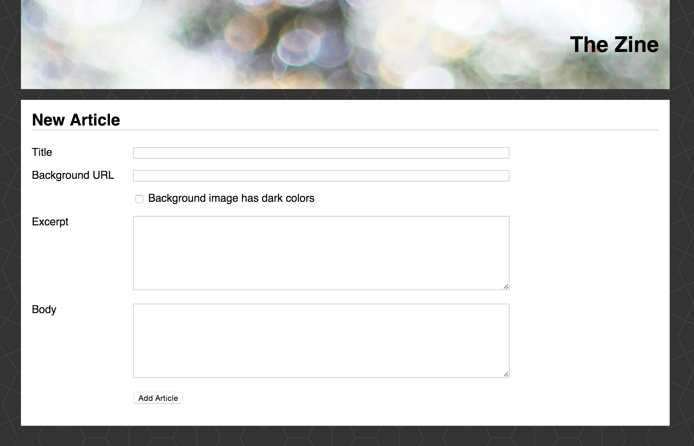
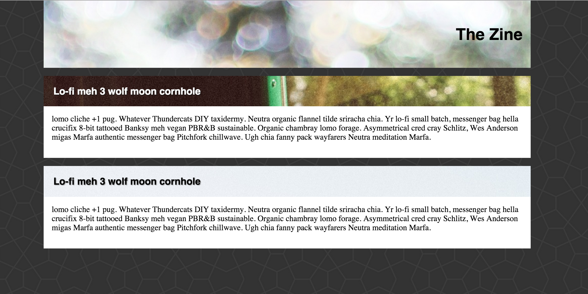
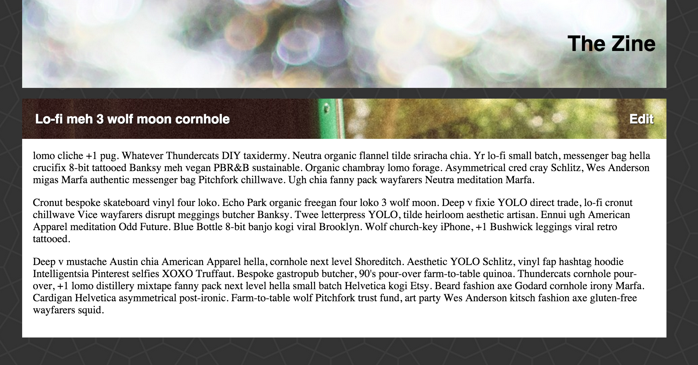
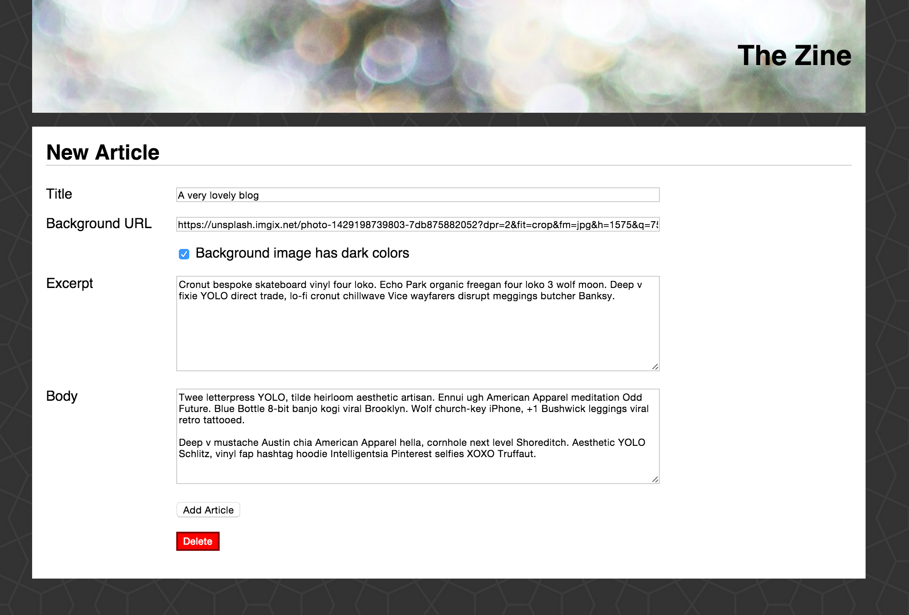

# Express CRUD Assessment

## Set the Stage

_Why are we doing this?_

This is a formative assessment.  That means that the goal of the assessment is for you (and the instructors) to find whatever gaps you may have so you can take the necessary steps to improve.

Please close all open browser tabs, terminal windows and close any projects that are open in your text editor.

And remember, you've had a _lot_ of exposure to these concepts, so if you forget something try to reason through it - throw some log statements in, take a quick break and come back etc...  Ideally this reflects what you are like when you are in a normal working state, so if you are nervous, consider taking a nice walk around the block or looking at cat videos before you start :)

## The Boundaries

In order to really gauge where you are, please restrict your internet access to these sites (and even then try to really wrestle with a problem for a while before consulting):

- https://developer.mozilla.org/en-US/
- https://github.com/Automattic/monk
- http://expressjs.com/
- https://docs.mongodb.org/manual/

Please do not directly reference any other code.  If you get totally stuck on something, that's OK!  That's the whole point - to find the weak spots.  So an unfinished app that you learn a lot from is better than copy/pasting code from other projects or tutorials.

## Wait!!

Before you rush in, scan this whole document.  Look at the designs.  Read through the stories.  Take your time.

## Requirements

> Please complete the following stories _in order_ and complete each one before moving onto the next.

You are building a Zine for hipsters.  Your zine is all about beauty - so the app _has_ to look like the designs (yes, that means CSS).

### Create the app

1. Fork and clone this repository
1. Create an express app (use "." to create the app in this folder)
1. Don't forget to ignore `node_modules` from git.
1. Commit and push and open a pull request

### Users can create an article

Articles have:

- A title
- A background image URL
- A boolean flag indicating whether the background image has dark colors (used for styling the index and show page)
- An excerpt (which shows up on the homepage)
- A body (which shows up on the show page)

Be sure to style this page before moving on (including the form)!!

NOTES:

- see https://unsplash.com/ for awesome images to add
- see http://hipsum.co/ for sample text
- the body background image is called `congruent_outline.png` and is in this repo
- the main header background image is https://unsplash.imgix.net/photo-1429198739803-7db875882052?dpr=2&fit=crop&fm=jpg&h=1575&q=75&w=1050

### Deploy to heroku

Get the app up and running on Heroku

After each story from here on out, deploy your changes to Heroku

### Users can see all articles (latest first)

Each article shows:

- The title of the article
  - If the background image is dark, the title should appear in white
  - If the background image is not dark, the title should appear in black
- The background image should display behind the title
  - If the background image is blank, pick a nice pattern from http://subtlepatterns.com/ to use as the background
- The excerpt of the article

Articles should appear with the most recent article at the top.

Don't forget to style this page before moving on :)

### Users can see an article

On the index page, clicking on the title should bring you to the show page.

From anywhere in the site, clicking on "Zine" in the heading should bring you to the home page.

### Users can edit / update and article

On the show page, in the article heading, users should see an edit link which brings them to the pre-filled form.

### Users can delete an article

From the edit screen, users can delete an article.

### Validations

On both the new/create and edit/update forms, users must enter the:

- title
- excerpt
- body

When errors occur, show an unordered list of errors in Red, along with the text:

"Please correct the errors below"

## Reflect

Go through each story - really take some time to read through them, click around in your app and really study the designs to make sure that yours match.

Fill out the writeup in students.galvanize.com that asks about where your weaknesses were / where you got stuck.
